## Задача 0

Убеждаемся, что docker-compose не установлен (compose standalone), и установлен plugin compose для docker:

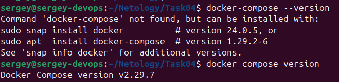

## Задача 1

Форк репозитория [https://github.com/SergueiMoscow/netology-devops-example-python](https://github.com/SergueiMoscow/netology-devops-example-python)

Клонируем:  
`git clone git@github.com:netology-devops-example-python Task04-python`
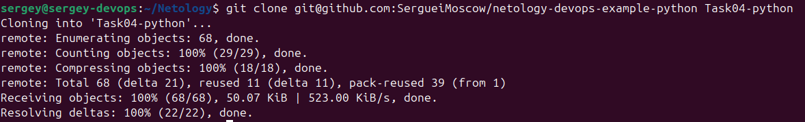

Подгружаем образ mysql:  
`docker pull mysql:latest`

Запускаем контейнер с mysql:
```
docker run --name mysql-container -e MYSQL_ROOT_PASSWORD=YtReWq4321 \
    -e MYSQL_DATABASE=virtd -e MYSQL_USER=app -e MYSQL_PASSWORD=QwErTy1234 \
    -p 3306:3306 -d mysql:latest
```
Т.к. нам нужны evn variables для запуска приложения, то передаём их напрямую в контейнер. Это небезопасно, т.к. простой командой:  
`docker exec mysql-container env`  
или  
`docker inspect mysql-container | jq '.[0].Config.Env'`  
можно вытащить все переменные из контейнера.


Создаём образ python приложения:
docker build -t netology-task4_1-python-app .

### Для запуска приложения без докера из PyCharm:
Чтобы глобально не устанавливать старую версию Python, используем `pyenv`, который позволяет управлять несколькими версиями Python локально в пределах проекта.

- Устанавливаем pyenv:  
`curl https://pyenv.run | bash`  
- Прописываем необходимые инструкции в `.bachrc`:
```
export PYENV_ROOT="$HOME/.pyenv"
[[ -d $PYENV_ROOT/bin ]] && export PATH="$PYENV_ROOT/bin:$PATH"
eval "$(pyenv init -)"
eval "$(pyenv virtualenv-init -)"
```
- Ставим зависимости для установки python:
```
sudo apt-get update
sudo apt-get install -y make build-essential libssl-dev zlib1g-dev \
libbz2-dev libreadline-dev libsqlite3-dev wget curl llvm \
libncurses5-dev libncursesw5-dev xz-utils tk-dev libffi-dev \
liblzma-dev python3-openssl git
```
- Ставим python 3.9 через pyenv  
`pyenv install 3.9.20`  
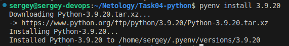

- Создаём виртуальное окружение  
`pyenv virtualenv 3.9.20 venv-netology-task4_1`  
- активируем
`pyenv activate venv-netology-task4_1`  
- и проверяем версию python:  
`python3 --version`  
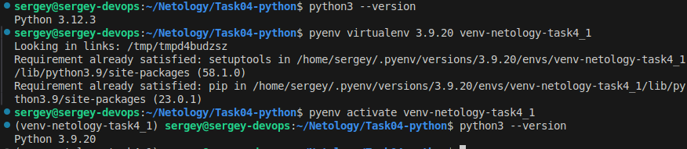

- ставим зависимости
pip install -r requirements.txt

- прописываем в .env файле необходимые переменные окружения:  
```
DB_HOST="127.0.0.1"
DB_USER="app"
DB_PASSWORD="QwErTy1234"
DB_NAME="virtd"
```
Прописываем этот app.env файл в параметры запуска и запускаем:
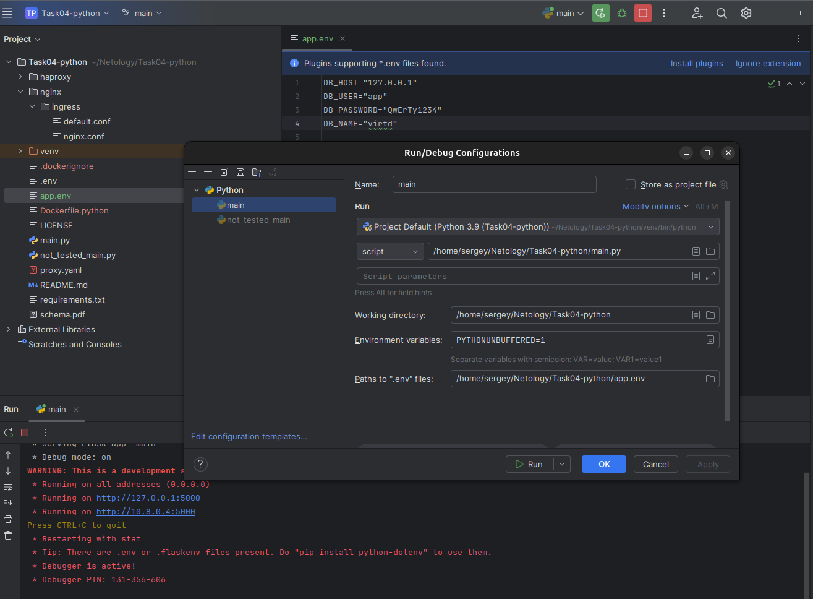

## Задача 2
Инструкция: https://yandex.cloud/ru/docs/container-registry/quickstart/?from=int-console-help  

- Создаём контейнер в Yandex Cloud:  
`yc container registry create --name s-registry`  
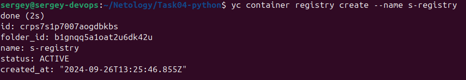
id: crps7s1p7007aogdbkbs


- Настраиваем аутентификацию:  
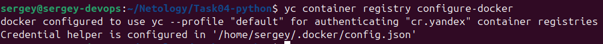  

- Строим образ:  
`docker build -f Dockerfile.python -t cr.yandex/crps7s1p7007aogdbkbs/netology-task4_2:1.0.0 .`  

- Загружаем его на Yandex Cloud:  
`docker push cr.yandex/crps7s1p7007aogdbkbs/netology-task4_2:1.0.0`
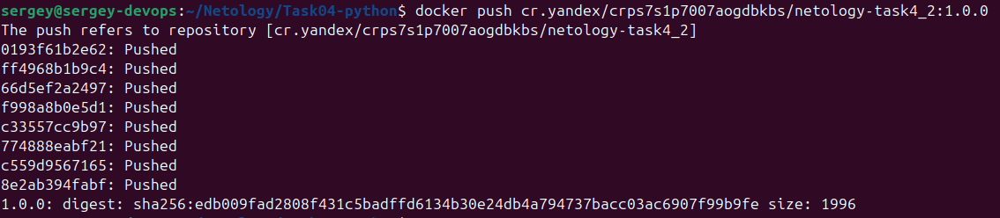

- Проверяем на уязвимости и получаем список:
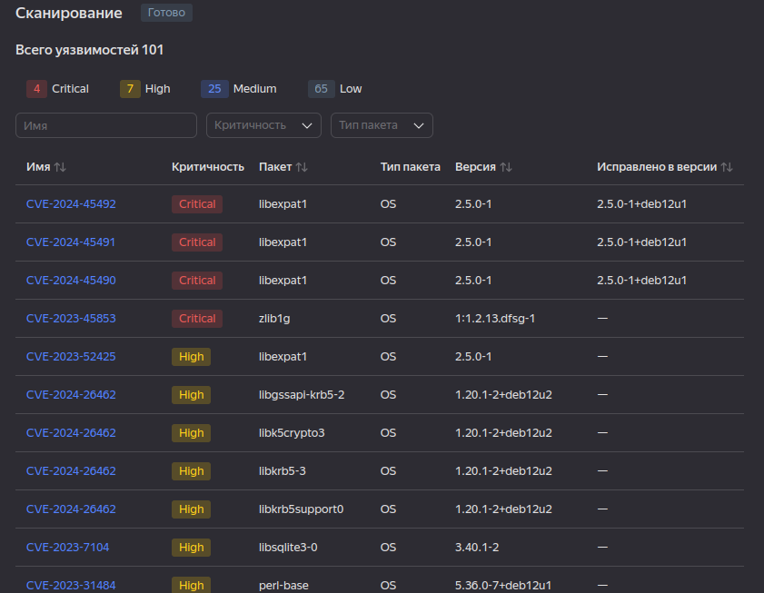

## Задача 3

- [Создаём compose.yaml](https://github.com/SergueiMoscow/netology-devops-example-python/blob/main/compose.yaml)

- Запускаем `docker compose up -d`  
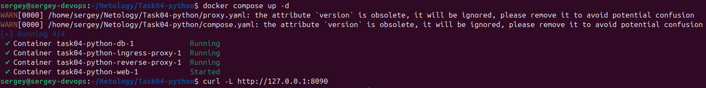


- Проверяем `curl -L http://127.0.0.1:8090`
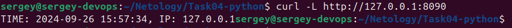

- Подключаемся к БД контейнера:
`docker exec task04-python-db-1 mysql -uroot -pYtReWq4321`
Эта команда не сработала:  
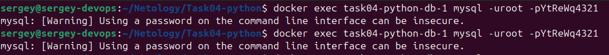

- Попытка № 2 подключения к контейнеру:
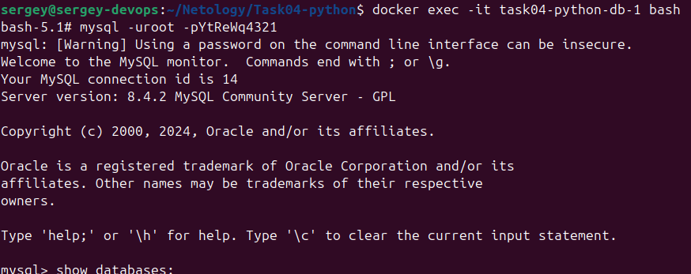

- Запрашиваем БД:  
```
show databases;
use virtd;
show tables;
SELECT * from requests LIMIT 10;
```  
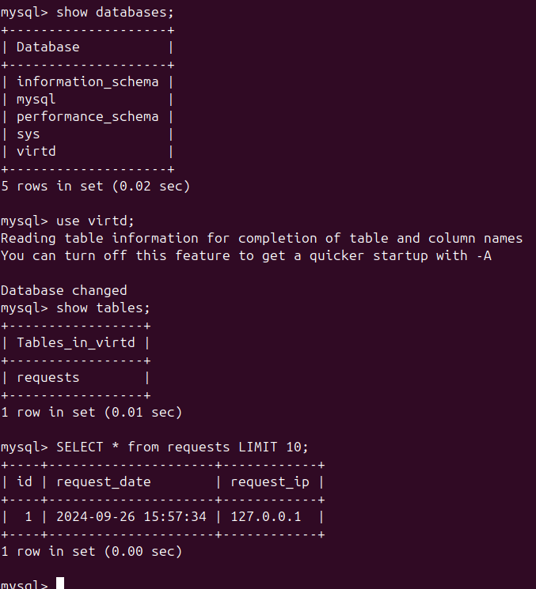

- Останавливаем контейнеры:
`docker compose down`  
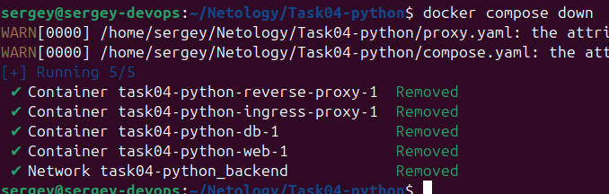

## Задача 4

- Создаём bash скрипт для создания ВМ yandex [src/create_yandex_vm](src/create_yandex_vm)

- Запускаем  
`src/create_yandex_vm`

- Проверяем в console.yandex.cloud:
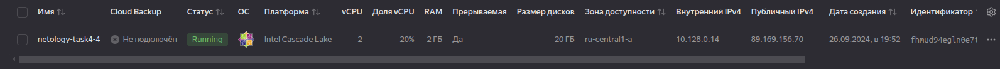

- подключаемся по ssh:
ssh yc-user@89.169.156.70

- ставим Docker, как описано в документации:
[docker install centos](https://docs.docker.com/engine/install/centos/):  
```
sudo yum install -y yum-utils
sudo yum-config-manager --add-repo https://download.docker.com/linux/centos/docker-ce.repo
sudo yum install docker-ce docker-ce-cli containerd.io docker-buildx-plugin docker-compose-plugin
```

- Также ставим git:  
`sudo yum install git`

- Проверяем:  
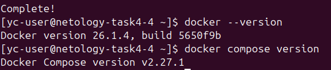

- Пишем скрипт для загрузки репозитория и развёртывания:
[script centos](src/install_centos)

- Копируем его на ВМ:  
`scp src/install_centos yc-user@89.169.134.71:/home/yc-user`

- Подсоединяемся по ssh:  
`ssh yc-user@89.169.134.71`

- Запускаем  
`sudo ./install_centos`

- Проверяем
http://89.169.134.71:8090
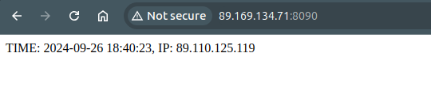

- Запускаем сервис проверки подключений:
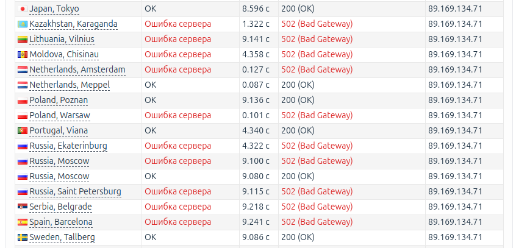

- Создаём контекст:
docker context create myremote --docker "host=ssh://yc-user@89.169.134.71"

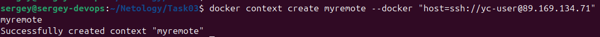  
```
docker context use myremote
docker context ls
docker ps -a
```
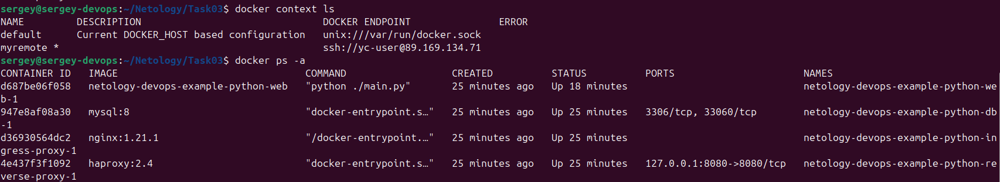

- Подключаемся к контейнеру с БД и выполняем запрос:
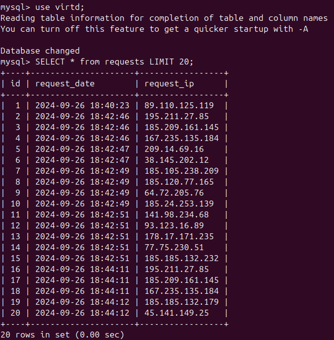

- Тот же запрос одной командой вместе с подключением к контейнеру:  
`docker exec -i netology-devops-example-python-db-1 mysql -uroot -pYtReWq4321 -e "SELECT * from virtd.requests LIMIT 20;" virtd`  
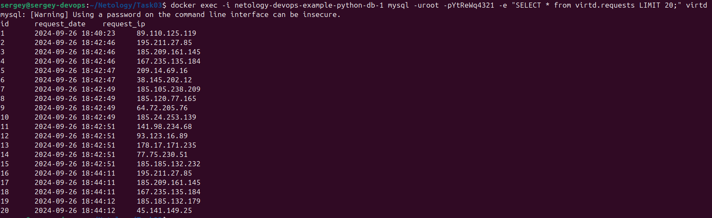

- Остановить и удалить ВМ:  
`yc compute instance stop fhmgsc4h2i45sjij6et8`  
`yc compute instance delete fhmgsc4h2i45sjij6et8`

## Задача 5

- Пишем скрипт [src/backup_db](src/backup_db)

- Даём разрешение на запуск и копируем в контейнер
`chmod 775 src/backup_db`
`scp src/backup_db yc-user@89.169.134.71:/home/yc-user`

- Подсоединяемся по ssh:  
`ssh yc-user@89.169.134.71`

- Запускаем  
Ошибка:
`mysqldump: Got error: 1045: "Plugin caching_sha2_password could not be loaded: Error loading shared library /usr/lib/mariadb/plugin/caching_sha2_password.so: No such file or directory" when trying to connect`

Тут, похоже, несовместимость шифрования паролей, как говорится в этом [ответе на stackoverflow](https://stackoverflow.com/questions/49194719/authentication-plugin-caching-sha2-password-cannot-be-loaded). Так что, если использовать этот образ нужно изначально шифровать пароли с этим учётом, для чего придётся вернуться к созданию контейнера с mysql.  
Чтобы этого не делать, как вариант, пишем [новый скрипт](src/backup_db2) на базе mysql и пытаемся запустить его.  
Обнаруживаем проблему с привилегиями, поэтому меняем пользователя mysql на root. Вот результаты обоих скриптов с пользователем root:
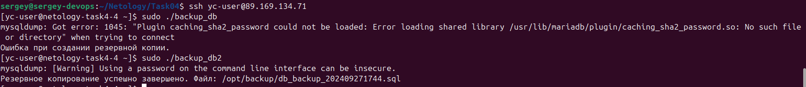

- Проверяем backup файл:
`cat /opt/backup/db_backup_202409271744.sql`
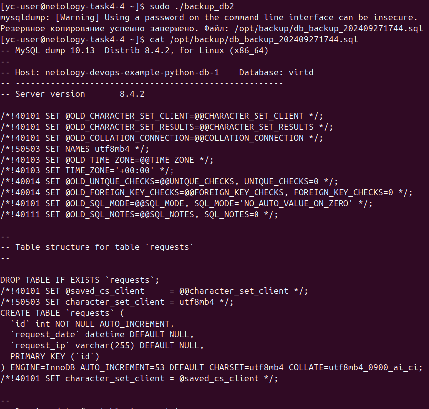

Все записи также присутствуют:
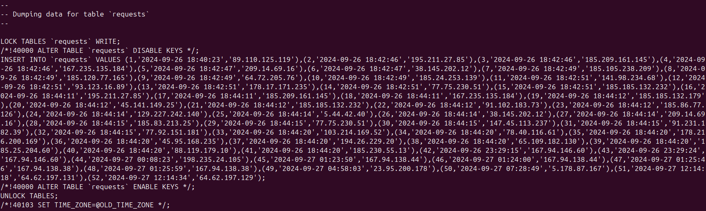

- Добавляем cron:  
`sudo crontab -e`
- Добавляем строку:  
`* * * * * /home/yc-user/backup_db2 >> /var/log/backup_db.log 2>&1`  

- Ждём несколько минут, проверяем:
`ls -la /opt/backup`  
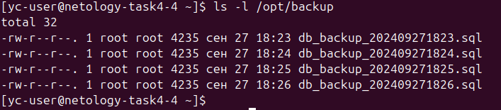

- Вариант, чтобы не светить пароли в git:  
Записать `.env` файл, например:  
```
DB_USER="root"
DB_PASSWORD="YtReWq4321"
```
В файле скрипта убрать эти переменные и подключить наш `.env` файл:  
`source .env`

## Задача 6
- Загружаем tarraform:  
`docker pull hashicorp/terraform:latest`  
- Сохраняем в файл:
`docker save -o terraform_latest.tar hashicorp/terraform:latest`
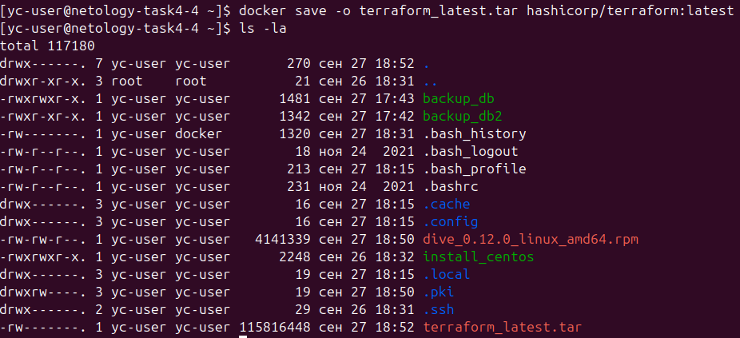
- Создаём временную директорию:  
`mkdir tmp`  
- Распаковываем образ:  
`tar -xvf terraform_latest.tar -C tmp`  
`cd tmp`  
- Запускаем `dive hashicorp/terraform`
- Находим в нём слой, где был добавлен terraform:
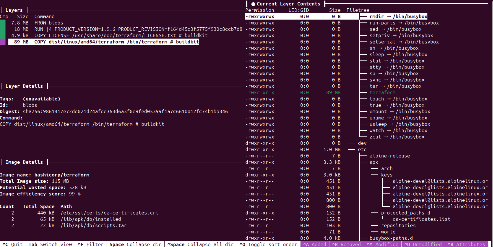
Найденный layer:
`9861417e72dc021d24afce363d6a3f0e9fed05399f1a7c6610012fc74b1bb346`
- Ищем layers в распакованном архиве:  
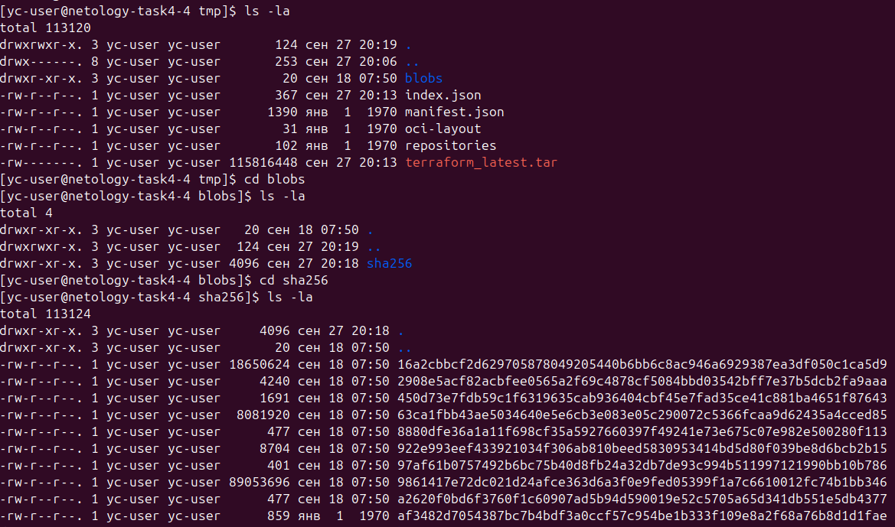
- Распаковываем:  
`tar -xf 9861417e72dc021d24afce363d6a3f0e9fed05399f1a7c6610012fc74b1bb346`
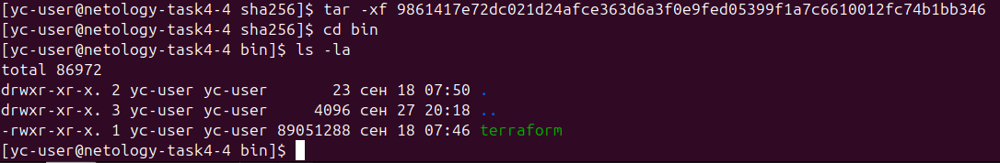
- Выходим из VM и копируем:  
`scp yc-user@89.169.144.39:/home/yc-user/tmp/blobs/sha256/bin/terraform terraform`  
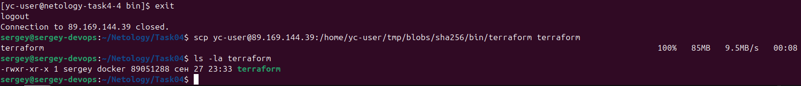

## Задача 6.1
- Запускаем контейнер terraform

docker run -d --name=terraform-container hashicorp/terraform:latest  
- Копируем из контейнера  
docker cp terraform-container:/bin/terraform /tmp/terraform  
- Выходим из ВМ и копируем на локальную машину  
scp yc-user@89.169.144.39:/tmp/terraform terraform  
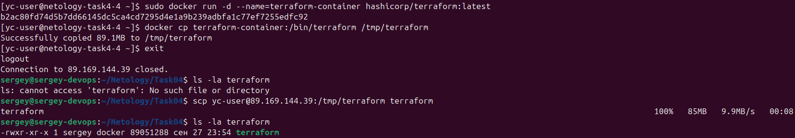

## Задача 6.2
- Создаём [Dockerfile](src/Dockerfile)  
- Копируем в ВМ:  
`scp src/Dockerfile yc-user@89.169.144.39:/home/yc-user`
- Запускаем:  
`docker build --output type=local,dest=./output - < Dockerfile`
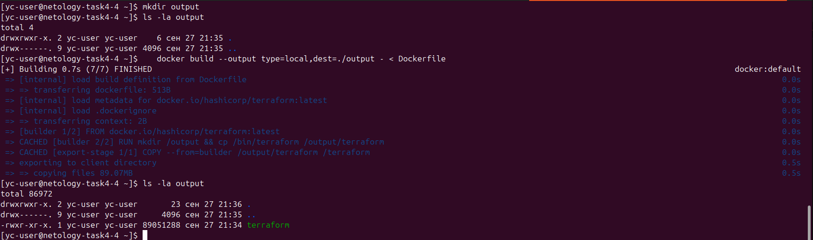

<!--
## Задача 7
[(Пример из презентации)](https://selectel.ru/blog/upravlenie-kontejnerami-s-runc/)  
- Сохраняем образ в файле:

- Создаём директорию под контейнер с приложением, в ней `rootfs`:  
```
mkdir web-app-container
cd web-app-container
mkdir rootfs
```
- Сохраняем содержимое контейнера в папке `web-app-container/rootfs`:  

`docker export $(docker create task04-python-web) | tar -C rootfs -xvf -`  
- Создадим файл конфигурации:  
`runc spec`
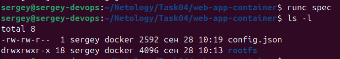

-->